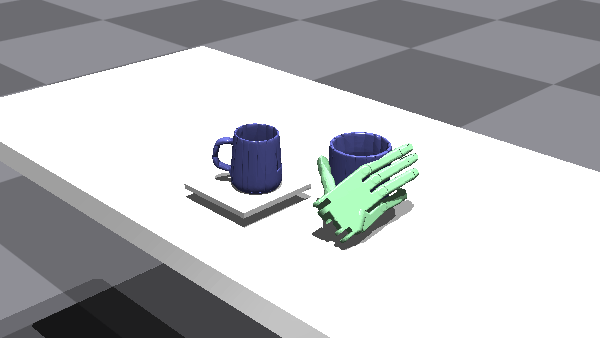

# OakInk2-SimEnv-IsaacGym

<div align="center">
  
</div>

1. Setup asset files.

    Download tarballs from [huggingface](https://huggingface.co/kelvin34501/OakInk2-SimEnv-IsaacGym-Asset/blob/main/oi2_dev.tar.xz). Extract the tarball under `asset/`.
    The directory structure:
    ```
    asset
    |--- mano_mod
    |--- oi2_dev
    |   |--- obj
    |   |--- obj_raw
    |   `--- pour
    |       |--- demo_raw
    |       |--- meta
    |       |--- ref_raw
    |       `--- task_list_rh__train.json
    `--- shadowhand_no_forearm
    ```

2. Setup the enviroment.

    1. Create a virtual env of python 3.8. This can be done by either `conda` or python package `venv`.
    
        1. `conda` approach
            
            ```bash
            conda create -p ./.conda python=3.8
            conda activate ./.conda
            ```

        2. `venv` approach
            First use `pyenv` or other tools to install a python intepreter of version 3.8. Here 3.8.19 is used as example:

            ```bash
            pyenv install 3.8.19
            pyenv shell 3.8.19
            ```

            Then create a virtual environment:

            ```bash
            python -m venv .venv --prompt OakInk2-SimEnv-IsaacGym
            . .venv/bin/activate
            ```

    2. Install the dependencies

        Make sure all bundled dependencies are there.
        ```bash
        git submodule update --init --recursive --progress
        ```

        Download [Issac Gym Preview 4](https://developer.nvidia.com/isaac-gym). Extract it under `thirdparty/isaac_gym/`. The directory structure:
        ```
        thirdparty
        |--- isaac_gym
        |   `--- isaacgym
        |--- ...
        ```

        Install the `pip` requirements.
        ```bash
        # essential
        pip install -r req_py38_isaacgym.example.txt
        # essential with devtools
        pip install -r req_py38_isaacgym_dev.example.txt
        ```

3. View the example script.

    ```bash
    python -m script.test_env_pour
    ```

    If you want to use reinforcement learning algorithms in this toolkit, there is an example in `src/dyn_mf/env/oi2_dev.py` to set the reward and observation functions. The observation and reward functions set in the current example file are both blank placeholders to be filled.